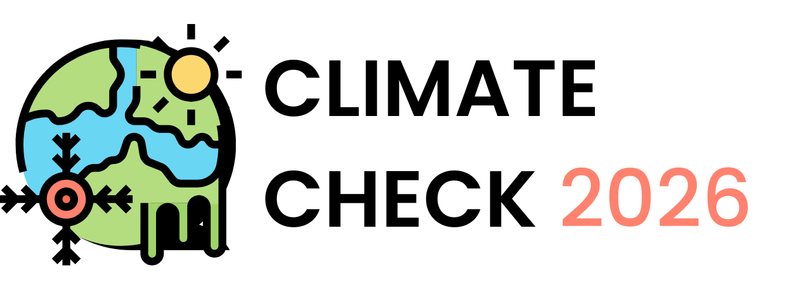

 

 
<h1> Shared Task on Scientific Fact-Checking and Disinformation Narrative Classification of Climate-related Claims</h1>

The rise of climate discourse on social media offers new channels for public engagement but also amplifies mis- and disinformation. As online platforms increasingly shape public understanding of science, tools that ground claims in trustworthy, peer-reviewed evidence are necessary. The new 2026 iteration of ClimateCheck builds on the results and insights from the 2025 iteration (run at SDP 2025/ACL 2025), extending it by adding training data, a new task on classifying disinformation narratives in climate discourse, and a focus on sustainable solutions.

What's new in the 2026 iteration?

* We released triple the amount of training data for task 1, enabling the development of more robust systems. The dataset is already available on [HuggingFace](https://huggingface.co/datasets/rabuahmad/climatecheck). 
* We're introducing a new task, disinformation narrative classification, which deals with identifying well-known climate disinformation narratives in our claims to potentially help with training systems for task 1.
* We're focusing on environmentally-friendly solutions, motivated by the system submissions from the 2025 iteration, which mostly used (commercial) LLMs. Our goal for this iteration is to motivate participants to develop reproducible and sustainable solutions to fact-check climate-related claims. 

## Tasks Overview

The following tasks are available: 

* **Task 1: Abstract retrieval and claim verification**: given a claim and a corpus of publications, retrieve the top 5 most relevant abstracts and classify each claim-abstract pair as supports, refutes, or not enough information.  
  **Evaluation**: Recall@K (K=2, 5) and B-Pref (for retrieval) + Weighted F1 (for verification) based on gold data; additional unannotated documents will be evaluated automatically. In addition, we will ask participants to use [CodeCarbon](https://codecarbon.io/) to assess emissions and energy consumption at test inference.
  
* **Task 2: Disinformation narrative classification**: given a claim, predict which climate disinformation narrative exists according to a predefined taxonomy.  
  **Evaluation**: Macro-, micro-, and weighted-F1 scores based on annotated documents. 

## Important Dates

* Release of datasets: December 15, 2025 (task 1); December 19, 2025 (task 2) -> Both datasets are now [available](https://huggingface.co/datasets/rabuahmad/climatecheck) for training!
* Testing phase begins: January 15, 2026 (Codabench link TBA)
* Deadline for system submissions: February 16, 2026
* Deadline for paper submissions: February 20, 2026 
* Notification of acceptance: March 13, 2026 
* Camera-ready papers due: March 30, 2026 
* Workshop: May 12, 2026

We encourage and invite participation from junior researchers and students from diverse backgrounds. Participants are also highly encouraged to submit a paper describing their systems to the NSLP 2026 workshop. 

## Datasets, Evaluation, and Rankings

The dataset for both tasks is now available on [HuggingFace](https://huggingface.co/datasets/rabuahmad/climatecheck); the claims in the test set will be the same as they 2025 iteration. The abstracts corpus for retrieval (task 1) is available on [HuggingFace](https://huggingface.co/datasets/rabuahmad/climatecheck_publications_corpus). 

Due to label imbalance in the dataset for both tasks, participants are allowed to ustilise external datasets and/or augment the data however they see fit. 

 

**Task 1: Abstract retrieval and claim verification**

The dataset for task 1 will follow the same structure as the 2025 iteration, but with triple the amount of available training data. We will evaluate systems on both abstract retrieval and claim verification tasks in an end-to-end manner. Abstracts retrieval will be evaluated using Recall@K and B-Pref, while claim verification will be evaluated using weighted F1 scores. Gold annotations will be used for both, with an LLM-as-a-judge approach to evaluate incomplete judgments iteratively. 

In addition, this year’s iteration will focus on coming up with sustainable solutions, encouraging the development of systems that can potentially be used in real-world scenarios. Thus, we will ask participants to use the CodeCarbon library when running the test inference to measure emission rates and energy consumption. This will not, however, be counted towards the final rankings. 

**Task 2: Disinformation narrative classification**

The dataset for task 2 will consist of the same claims used for task 1, each annotated with labels denoting whether the claim is an example of a known climate disinformation narrative, and if so, which one(s). We follow the CARDS taxonomy (levels 1 and 2) developed by Rojas et al. (2024) to label our claims in a multi-label manner. Results will be evaluated using macro-, micro- and weighted-F1 scores.   

Participants can take part in task 1, task 2, or both tasks (better yet - think of ways to incorporate task 2 into the task 1 pipeline!).

More information will be available soon regarding registration via Codabench and how to use CodeCarbon at inference to track emissions. In the meantime, the [dummy competition](https://www.codabench.org/competitions/8304/) from last year's iteration is available, which you can test your task 1 predictions on, since the same test set will be used. However, note that we will add an automatic evaluation metric for unannotated documents; thus the results might not be accurate but they can give a good indication!

## Shared task organisers:

* <a href="mailto:raia.abu_ahmad@dfki.de">Raia Abu Ahmad (DFKI Berlin)</a>
* <a href="mailto:aida.usmanova@stud.leuphana.de">Aida Usmanova (Leuphana University of Lüneburg)</a>
* <a href="mailto:max.upravitelev@tu-berlin.de">Max Upravitelev (XplaiNLP Group, Technische Universität Berlin)</a>
* <a href="mailto:georg.rehm@dfki.de">Georg Rehm (DFKI Berlin)</a>

## References and further reading:
* Abu Ahmad, R., Usmanova, A., & Rehm, G. (2025, July). [The ClimateCheck shared task: Scientific fact-checking of social media claims about climate change](https://aclanthology.org/2025.sdp-1.24.pdf). In Proceedings of the Fifth Workshop on Scholarly Document Processing (SDP 2025) (pp. 263-275).
* Abu Ahmad, R., Usmanova, A., & Rehm, G. (2025, July). [The ClimateCheck dataset: Mapping social media claims about climate change to corresponding scholarly articles](https://aclanthology.org/2025.sdp-1.5.pdf). In Proceedings of the Fifth Workshop on Scholarly Document Processing (SDP 2025) (pp. 42-56).
* Rojas, C., Algra-Maschio, F., Andrejevic, M., Coan, T., Cook, J., & Li, Y. F. (2024). [Hierarchical machine learning models can identify stimuli of climate change misinformation on social media](https://www.nature.com/articles/s43247-024-01573-7). Communications Earth & Environment, 5(1), 436.
