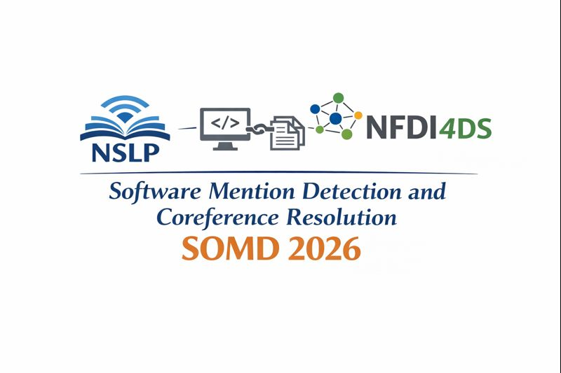

 

 
  
<h1> SOMD 2026: Software Mention Detection and Coreference Resolution </h1>

We address the task of coreference resolution of software mentions across multiple documents, i.e. given a set of software mentions extracted from multiple scientific publications, related extracted attributes as well as sentences in which these occur, cluster these mentions so that all software mentions in a particular cluster refer to the same real world software. 
This task will build on [SOMD 2025](https://sdproc.org/2025/sharedtasks.html#somd) (run at [SDP 2025](https://sdproc.org/2025/), co-located with ACL 2025) and focus on entity disambiguation via coreference resolution as an under-investigated problem in this context. More precisely, SOMDi2026 will tackle the following tasks:

**Subtask 1:** Software coreference resolution over gold standard mentions.
Addresses the task based on high-quality (gold standard) mentions of software that are expert-annotated in multiple publications.

**Subtask 2:** Software coreference resolution over predicted mentions.
Addresses the task on software mentions that are automatically extracted using a baseline model, i.e. reflecting a typical information extraction scenario, where upstream pipelines (such as entity and metadata extraction) are imperfect. 

**Subtask 3:** Software coreference resolution at scale. 
For this subtask, we provide predicted mentions of software and metadata at a larger scale. This challenges models to scale effectively, maintain accuracy, and distinguish among an increasingly dense field of similar or overlapping software mentions.

## Important Dates

  * Registration Opens: December 22–23, 2025
  * Train/Test Data Release (All Subtasks): January 10, 2026
  * Competition Phase: January 10 – February 10, 2026 (via Codabench,  link TBA)
  * System Paper & Code Submission Deadline: February 20, 2026
  * Notification of Acceptance: February 28, 2026
  * Camera-Ready Papers Due: March 27, 2026
  * Workshop Date: May 12, 2026

Shared task organisers: 

* Sharmila Upadhyaya (GESIS Leibniz Institut für Sozialwissenschaften, Germany)

* Wolfgang Otto (GESIS Leibniz Institut für Sozialwissenschaften, Germany)

* Frank Krueger (Wismar University of Applied Sciences, Germany)

* Stefan Dietze (GESIS Leibniz Institut für Sozialwissenschaften, Cologne & Heinrich-Heine-University Düsseldorf, Germany)

References

* Schindler, David et al. “The role of software in science: a knowledge graph-based analysis of software mentions in PubMed Central.” PeerJ Computer Science 8 (2022): n. pag.

